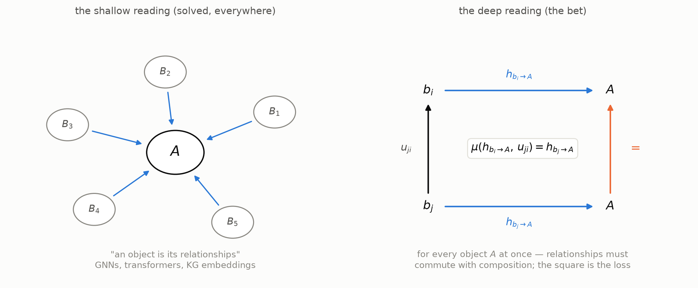
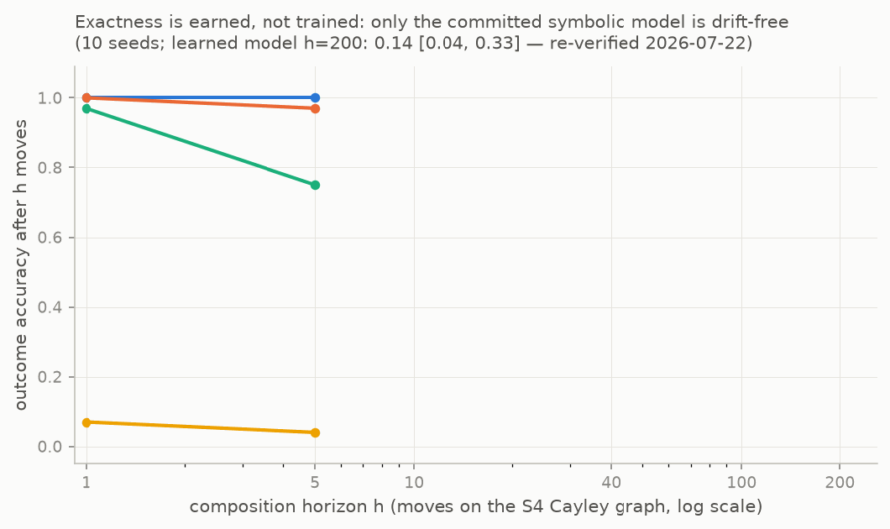
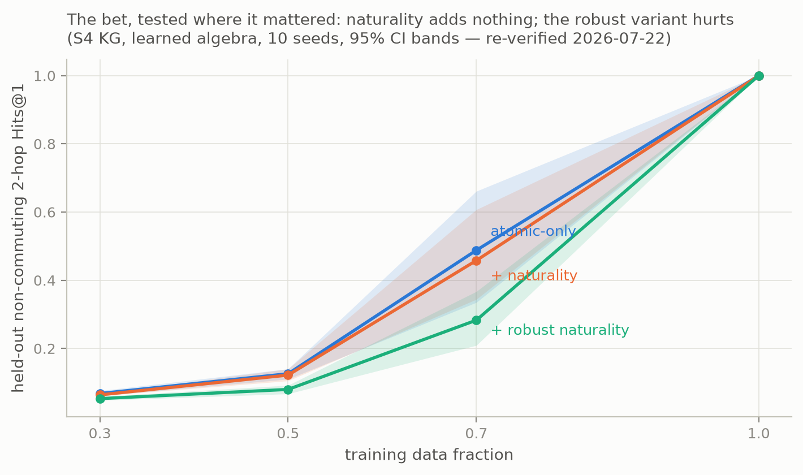
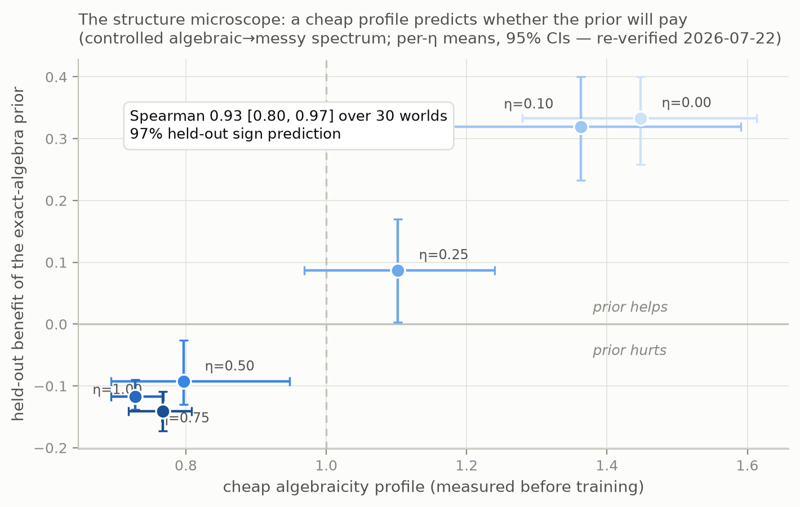

# Rinsing the Yoneda Lemma

*I tried to make the Yoneda lemma a training signal - an architecture where "the diagram must commute" is the one learned constraint. The mechanism the project was named for turned out to carry none of the headline results - the composition algebra underneath carried all of them. This is the story: some genuinely beautiful mathematics, what I built on it, the numbers as they actually fell, and the three things that still work.*

**This article ships with its repository ([github.com/Haksaw22/Yoneda-ML](https://github.com/Haksaw22/Yoneda-ML)): the research record is vendored with minimal redactions under [research/](research/), every quoted number was re-verified by fresh re-runs ([REVALIDATION.md](REVALIDATION.md)), and a pre-executed [playground notebook](playground.ipynb) rebuilds every figure.**

## Why Yoneda?

Along my journey through abstract algebra, naturally, I came across its seemingly more general cousin, category theory. Group theory had already won me over with structure-preserving maps - abstract patterns getting carried to outputs in strong correspondence, without disrespecting the structure - and category theory essentially takes that one habit and makes it the whole subject: forget what the objects are, keep the maps between them. One of the most beautiful statements to fall out of that austerity is the Yoneda lemma.

Stated properly: for an object `A` of a category, form the functor `Hom(−, A)` - send every object `X` to the set of maps `X → A`. The lemma says that for any set-valued functor `F`, the natural transformations from `Hom(−, A)` to `F` correspond exactly to the elements of `F(A)`:

```
Nat( Hom(−, A), F )  ≅  F(A)
```

Put `F = Hom(−, B)` and you get the corollary people actually quote: if the maps into `A` and the maps into `B` match up *naturally*, then `A ≅ B`. An object is determined, up to isomorphism, by how everything else maps into it. You could throw the object away, keep the table of relationships, and mathematically you've lost nothing.

Now immediately, the most natural ML parallel to this sits inside the transformer - the attention mechanism does something very similar. A token doesn't carry its meaning around intrinsically - each layer rebuilds it from its pattern of interactions with everything else in the context. Squint and that's `Hom(−, A)` sampled on a context window: the token is its incoming-relationship profile. So the question practically asks itself - where exactly are the differences, and is there anything in Yoneda's statement I could really bring to life in a way attention doesn't already replicate?

Chasing the differences down, I found three. Attention's probe set is just whatever happens to share the context window, rather than "everything else". Its relationships are similarity scores - there's nothing to compose, no sense in which the `A→B` relationship followed by `B→C` should yield the `A→C` one. And the third one is where the real gap sits: the lemma's power is in the fine print - naturality. The web of relationships determines the object *only if* the web is consistent under composition: going around a diagram one way must equal going around the other way, for every object at once. A directory of who-knows-whom isn't enough for the theorem - the directory has to agree with itself under friend-of-a-friend. Relational representations are everywhere in ML, and this commuting constraint gets *named* all over the place, but as far as I could find nobody actually optimizes for it - no mainstream architecture trains on "the diagram must commute". That looked like either an open opportunity, or something plenty of people before me had tried and found a good reason to drop, and I wanted to know which. (The version of the question I actually typed into a chatbot late one evening was: *do transformers have a sense of the Yoneda lemma?*)



There was another perspective that dawned on me whilst studying group theory through a different lens - representation theory. This comes across to me as possibly one of the most profound, and possibly unintentional, links between the matrix-rich, linear-operation-rich machinery of ML and groups & other algebraic objects: representation theory literally uses matrix operations to *represent* algebraic structure. Take the rotations of a square. Send the quarter-turn to the matrix

```
R = [ 0 −1 ]
    [ 1  0 ]
```

and the group is now inside linear algebra: two quarter-turns is `R²` (which is `−I` - the half-turn), four is `R⁴ = I`, and composition of rotations has become matrix multiplication. Nothing about the group was lost in translation - that's what "representation" means here. And it isn't a special trick for rotations either: every finite group embeds into permutation matrices (Cayley's theorem, acting on its own elements), and the construction extends past groups - a non-invertible operation like `is-a` or `causes`, which merges distinct inputs into one output, becomes a perfectly respectable *collapsing* 0/1 matrix. On a finite world, even "nonlinear" just means a matrix with repeated columns.

So the food for thought rather writes itself: neural networks spend their entire lives multiplying learned matrices - the exact raw material representation theory is built from. Are they natively able to represent algebraic structures like groups? Or do their instincts drive them away - toward banks of operators that resemble an algebra locally but never close into one? There's evidence both ways. Networks trained long enough on modular arithmetic famously end up implementing its Fourier representation - the grokking results ([Nanda et al.](https://arxiv.org/abs/2301.05217)) - so the destination is reachable. But nothing in gradient descent *asks* for closure: a transformer's operators compose across layers without any law tying the products together, which is algebra with the laws stripped out. This project ended up measuring a small version of that question directly, and the answer was not the flattering one.

Really, the culmination of these thoughts coagulated into an actual design - and into a project named after the lemma.

## What I actually built

The architecture that came out of the design round is called **PreNat**, and it makes two commitments, one for each of the threads above.

First, from the representation-theory thread: composition is exact by construction. Relations are codes `c ∈ ℝⁿ` in a fixed associative algebra with structure constants `T[k,g,h] = 1 iff g∘h = k` (essentially the multiplication table stored as a 0/1 tensor), a relation acts as the matrix `ρ(c) = Σₖ cₖ Rₖ`, and composing two relations is the algebra product itself. Associativity and identity hold by construction as identities of the algebra, so there's no loss term for them at all. The reason is an engineering one: soft associativity penalties are trivially minimized by collapse - map everything near zero and every constraint is satisfied - and I didn't want to spend the project fighting degenerate optima that exactness rules out for free.

Second, from the Yoneda thread: naturality is the one learned constraint. An object `A` is represented by its hom-profile against a set of probe objects (the who-maps-into-it directory from earlier, restricted to a fixed probe set), and the loss asks, for every probe morphism `u_ji` and *every object A at once*,

```
μ( h_{bᵢ→A} , u_ji ) = h_{bⱼ→A}         for all A.
```

That `∀A` quantifier is the natural-transformation content - it's what separates this from RotatE-style parameter tying (object-free) and from sheaf-style local agreement (edge-local, path-dependence tolerated).

The design round also wrote down, before any experiment, the pass/fail lines the project would be held to ([research/Yoneda-NN-Design.md](research/Yoneda-NN-Design.md), §6) - among other criteria, verbatim: *"the design is dead if: … the hard-wired variant matches soft across the entire η-sweep including large η."* Holding the project to that sentence turned out to be most of the work.

## The runs

Ten runs in one overnight session (June 28–29, timestamps 14:33 to 05:41 - the project predates its own version control), all CPU, seconds to minutes each, nothing larger than 135 entities (no GPU was harmed in the making of this article). The full record with corrections layered in place is vendored ([research/RESULTS.md](research/RESULTS.md), [research/CHANGELOG.md](research/CHANGELOG.md), [research/PAPER.md](research/PAPER.md)), and every number below is from the rigor round (10 seeds, tie-aware metrics, bootstrap 95% CIs) and has been re-verified by re-run for this article ([REVALIDATION.md](REVALIDATION.md)).

The first experiment was the pre-registered make-or-break: a synthetic world with a functoriality-violation knob η (the fraction of composites that deviate from exact algebra closure), comparing *learned* soft naturality against *hard-wired* naturality. At η=0 hard-wiring is correctly specified, so a tie was predicted - and observed, exactly (both 0.000 error). For η>0, soft beat hard at every level, and a robust (Welsch) variant beat everything through η=0.3: at η=0.1, robust-soft 0.185 vs hard 0.346 vs no-naturality 0.510 ([results.csv](research/experiments/eta_sweep/results.csv), normalized MSE - lower is better). The fail line the design fixed in advance - hard-wiring matching soft across the whole sweep - didn't fire. (To be frank, these are 3-seed, pre-rigor numbers with no CIs - what makes them quotable is that the per-seed CSVs are on disk and the direction is consistent in every seed-by-η pair.)


One wrinkle, diagnosed at the time: at large η plain naturality *amplifies* corruption - the loss forces an object's probes to be consistent with each other, so one corrupted observation propagates to the rest of the profile. In hindsight that's fairly obvious - being consistent with a corrupted observation just spreads the corruption around. The robust loss mostly fixed it, though the failure mechanism itself comes back later in the story.

## Did the exact algebra pay?

The external validation moved to knowledge-graph path queries: train on single edges only, evaluate held-out 2-hop compositions (follow one relation, then another), with the order-sensitive (non-commuting) subset as the discriminator. On a graph whose relations genuinely form the non-abelian group S4 ([rigor.py](research/experiments/kg_compose/rigor.py) §A, 10 seeds, tie-aware Hits@1 - did the model's top pick land on the right answer):

| model | held-out non-commuting composition | at 50% data | rel. params |
|---|---|---|---|
| TransE (additive) | 0.035 | 0.030 | 1× |
| RotatE (abelian) | 0.375 | 0.260 | ~1× |
| RESCAL (free matrices) | 0.825 [0.79, 0.87] | 0.208 | 6.75× |
| **PreNat (right algebra)** | **1.000** | **0.687 [0.54, 0.83]** | 1× |

The abelian failure is structural rather than under-tuning: rotation and translation commute, so an abelian model *cannot* tell `r₁∘r₂` from `r₂∘r₁` - it has to average them. Free matrices can represent the composition but must learn it edge by edge, which is why they crumble at half data (0.21 vs 0.69, paired p=0.002 - the floor of a 10-seed paired sign test, so read every p=0.002 in this piece as "all ten seeds agree", not as a precise tail probability) with ~7× the parameters. The same pattern holds for non-invertible relations (the transformation monoid T₃ - the collapsing-matrix case from earlier: several heads map to one tail, which bijective rotations cannot represent): PreNat 0.884 [0.84, 0.93] vs RotatE 0.409 ([rigor.py](research/experiments/kg_compose/rigor.py) §B).

There are two fair objections here, and the project eventually had to eat both.

*"You handed it the right algebra."* True - and given the algebra, 1.000 on composition is basically an identity rather than a capability. What rescues the result is that the algebra is *discoverable*: enumerate the five groups of order 8, train with each, select by validation path accuracy (there are only five, which makes brute force sound cleverer than it is). The true group wins 10/10 seeds on Q8 data, 8/10 on D4 - including telling the two *non-abelian* candidates apart in both directions ([rigor.py](research/experiments/kg_compose/rigor.py) §D). A full discover→identify→commit pipeline then converts the selected group into a symbolic model that is drift-free *because* the discovery step succeeded, rather than because anyone handed it the answer: at horizon 200 the discovered-and-committed model holds 0.78 [0.55, 0.93] where committing to a wrong group gives 0.24 (p=0.007) ([discover_compose.py](research/experiments/kg_compose/discover_compose.py)).

*"Real relations aren't algebraic."* Also true. On UMLS (a real biomedical KG) the learned-algebra variant has the best atomic link prediction (MRR 0.877) but loses composition to free matrices badly (0.537 vs 0.889): real relations don't compose associatively, and the exact prior becomes a straitjacket. Relaxing it with a per-relation residual recovers free-matrix composition (0.876) while the residual's size *measures* each dataset's algebraicity - UMLS reports ~3% algebraic, S4 reports 100% ([soft_alg.py](research/experiments/kg_compose/soft_alg.py), [kg_real.py](research/experiments/kg_compose/kg_real.py)).

While we're on real graphs, I should own up to two things. ULTRA - the must-beat baseline the design doc itself named - never ran, and early drafts implied otherwise, which is worse than not running it. The synthetic worlds have featureless entities, which makes ULTRA's inductive-transfer setting degenerate on them - a fair fight needs real KGs plus the published checkpoint, and it's the first thing a second session should do. That session should also meet a real typed KG at scale - UMLS, Kinship, and Nations are small, and FB15k-237 / WN18RR are where the typed machinery would face a proper test.

Then came the biggest claim of the lot: long-horizon composition on the S4 Cayley graph - predict the state after h moves. Free matrices compound per-step error and decay to chance by h=40, while PreNat held 1.00 at every horizon, and "Exact composition = zero drift, forever" made it into the report headline.

The independent audit cut that one down to its true size ([rigor.py](research/experiments/kg_compose/rigor.py) §C, 10 seeds): the *gradient-learned* PreNat is not drift-free - its codes never lock exactly onto the algebra basis (a gauge problem the record describes and does not solve), so it holds to h≈100 and then collapses (h=200: 0.14 [0.04, 0.33]). The drift-free guarantee belongs only to the *committed symbolic* model - the one produced by the discover→identify→commit pipeline above. So the honest statement is that you earn exactness by discovering the right structure and committing to it, rather than by having an exact algebra sitting in the training loop. In fact, on small clean worlds a free-matrix model can lock exact permutations and out-drift the learned PreNat.



## So what about the naturality loss?

Anyway, now the awkward part: the project's *stated* core mechanism - naturality as a learned loss - was absent from every headline KG experiment. The wins above came from models trained on plain atomic cross-entropy. The naturality loss lived in the synthetic world and in the project's name, and nowhere else. Nobody noticed until the audit asked - me included.

So the final run gave it the fairest shot available in the flagship setting: the learned-algebra model, the full data spectrum, plain and robust variants, 10 seeds, CIs, paired tests ([nat_kg.py](research/experiments/kg_compose/nat_kg.py) - what's tested is the commuting-square constraint in its KG-native form, consistency between a composed path and its direct counterpart):

| data fraction | atomic-only | + naturality | + robust naturality |
|---|---|---|---|
| 1.00 | 1.000 | 1.000 | 1.000 |
| 0.70 | 0.488 [0.34, 0.66] | 0.458 [0.34, 0.61] | 0.283 [0.21, 0.37] |
| 0.50 | 0.126 | 0.122 | 0.080 |
| 0.30 | 0.068 | 0.064 | 0.053 |

No significant gain anywhere - and the robust variant, the best performer back in the synthetic world, actively *hurts* below full data, because down-weighting inconsistent paths down-weights exactly the scarce paths carrying signal. (How much it hurts at 0.70 is seed-sensitive: the original run reported 0.199, this article's re-verification got 0.283. The direction is stable even if the magnitude isn't - see [REVALIDATION.md](REVALIDATION.md).) The intuition for the null result honestly took me longer than the result itself: under scarcity, the binding constraint is that *entities* are under-determined, and path-consistency is a constraint among relations - enforcing consistency among things you don't know doesn't create knowledge of them. Meanwhile at full data the algebra already composes exactly, so there's nothing left for naturality to add.

So that's the retirement: naturality-as-a-loss didn't carry a single headline result - the wins came from the exact, discoverable composition algebra. The scope does matter in both directions though. Naturality-as-a-loss does real work where it's the *only* channel binding under-determined observations to each other - the synthetic world from the η-sweep, where observations are partial and noisy and nothing else ties an object's probes together (removing it there costs 0.000 → 0.460 even at η=0). It's redundant where atomic supervision plus an exact algebra already pin the codes, and it cannot repair entity under-determination - which between them cover the flagship setting at every data fraction. And there's a sharper point buried in there: the design passed the pass/fail line it fixed in advance for itself (soft vs hard), and then failed a harder null the original pre-registration never thought to pose - naturality vs *nothing*, in the setting where the wins live. It took an external audit to force that question.

This is also the honest answer to the question the opening asked - whether networks natively represent algebra, or drift away from it. A generic net at this scale memorises the group's products rather than acquiring the group (it composes held-out 2-hops at 0.74 where the built-in algebra gets 1.0). An unconstrained operator bank composes but never closes, so its errors compound. And the consistency pressure I picked couldn't manufacture closure from scarce data. As far as these ten runs go, the algebra doesn't just emerge - you either build it in, or you discover it and commit to it.



## What survived

So what actually came out of all this still working? Three things, as it turns out - and none of them is the thing I set out to build.

The first is the exact-algebra prior, with its envelope mapped. Where relations genuinely form a group / monoid / category: zero-shot composition that abelian embeddings structurally cannot do, ~7× parameter efficiency against free matrices, a 3× data-efficiency margin in the mid-data regime, and drift-free long horizons after committing to *discovered* structure. Where they don't (every real KG tested): a straitjacket, to be relaxed by a residual. Having both edges of that envelope mapped is the part I'd actually defend.

The second is the structure microscope: a cheap profile of a relation set - functionality, invertibility, non-abelianness, algebraicity - that *predicts* whether the exact prior will pay before you train anything expensive. On a controlled algebraic→messy spectrum the cheap profile's correlation with the held-out benefit of imposing the prior is Spearman 0.93 [0.80, 0.97] over 30 worlds in this article's re-run (the original report: 0.95 [0.85, 0.98] over 36 worlds at one more seed per level), with 97% held-out sign prediction in both ([microscope_calibration.py](research/experiments/kg_compose/microscope_calibration.py)). Two caveats ride along, stated in the paper and kept here: the worlds derive from 6 independent noise levels (so the CI is indicative rather than gospel), and the validation shows a cheap proxy forecasting the expensive version of the *same* comparison - a useful instrument rather than a universal structural fingerprint. On real KGs it correctly reports "messy, prior won't help" - including Kinship, whose relations compose *semantically* but are not algebraic *as data*, a distinction I didn't have before this instrument existed.



The third is the uniqueness certificate. The project's moonshot (LIMN) was concept-minting by universal property: create a new latent object when a diagram *demands* one. Existing concept-discovery systems justify abstractions by compression - a universal property demands something sharper, existence *and uniqueness* of a mediating morphism. The validated atom: with the latent dimension unknown and the data noisy, "mint the biggest apex that fits" scores 0.00 (many over-complete apexes fit - they are weak limits), while the uniqueness certificate - in the linear case, just a spectral-gap rank test on the stacked projections, nothing fancy - recovers the true dimension at 1.00 [0.98, 1.00] across noise levels ([limn_hard.py](research/experiments/kg_compose/limn_hard.py)). It's one validated mechanism rather than a system - LIMN as a system was never built - and it waits on reliable structure to run on. Which brings me to the scarce-data problem.

## The scarce-data problem

There was one problem the project ran into from five different directions and couldn't dent: learning algebraic structure from scarce data. In the experiment built around it (S4 at half data, [codelock.py](research/experiments/kg_compose/codelock.py)), the handed-in algebra still composes at 0.52 while every learned-structure attack sits at or below 0.13 - a gap of 4× that five independent attacks failed to dent. (To be frank about the numbers: the fixed-algebra model's 50%-data score appears as 0.69 in the rigor suite and 0.52 here - different scripts, different configurations, both re-verified. The historical record never reconciled the two phrasings and [REVALIDATION.md](REVALIDATION.md) lists that among its known inconsistencies. The 4× gap is what matters, and it's stable.)

| attack | result |
|---|---|
| naturality self-supervision | no help (too few observed paths) |
| freeze entity embeddings (removes the gauge freedom) | worse |
| low-rank structure constants | worse |
| sparsity pressure toward one-hot codes | no change |
| transfer a correctly-learned algebra from an abundant source | no help - the algebra lives in the source's basis, and aligning bases is the same under-determined problem |

The recipe the project settled on - *fix or select* structure when data is scarce, *learn* it only when data is abundant - had a hole the record did not advertise: every selection experiment ran at full data, so the "select" branch was an extrapolation exactly into the scarce-data regime. Before publishing this piece I ran the missing probe, pre-registered with predictions and a pass/fail line written down before any results existed ([PROBE-PREREG.md](revalidation/PROBE-PREREG.md), [select_scarce.py](revalidation/select_scarce.py)): selection over the five order-8 groups at 100/50/30% data, ten seeds, with a learn-from-scratch arm as contrast.

The result cut the prediction in half, which I suppose is exactly the sort of thing pre-registering is for. At half data selection is group-dependent: on Q8 it holds - 9/10 correct, and precisely at the frontier the recipe cares about (the handed-in algebra still composes at 0.87, learning from scratch collapses to 0.50, and the *selected* algebra matches the oracle at 0.86) - while on D4 it collapses to 3/10, with the true-vs-best-wrong validation margin indistinguishable from noise (p=0.74). D4's compositional signature was already the harder one at full data (margin +0.072 vs Q8's +0.132) - scarcity erases it. By 30% data selection degrades toward chance on both groups, and on D4 the validation signal actively *prefers* a wrong abelian group (negative margin, p=0.03). So the recipe survives, but now with its boundary drawn: selection works at moderate scarcity only when the algebra's compositional signature is distinctive enough to keep a validation margin, and "fix" is the only branch that never depends on the data being able to identify the structure.

The open question the project leaves behind, sharpened: what objective makes structure learnable - or even reliably *selectable* - at the data scales where imposing it pays most? Nothing in these ten runs answers it, and it's the question I'd spend the next overnight session on. (It bothered me enough that the problem eventually got its own follow-up - [Really Rinsing the Yoneda Lemma](https://app.notion.com/p/Forced-Moves-3a935890b98b815ea4a8de76c0a99c49).)

## What I take from it

Three lessons, and I doubt I'd have accepted any of them secondhand.

First: ablate your own headline mechanism, in the setting you actually care about, before anything else. The naturality loss ran the synthetic world and then just stopped appearing in the experiments that mattered, and the project's framing coasted on the name for eight runs. It took an external audit to force the question - and I suspect that's the general shape of it: the mechanism a project is named after is exactly the one every result feels like evidence for, so it's the one most likely to escape its own test.

Second: constraints as identities beat constraints as penalties. Every degenerate optimum I never had to fight - collapse under associativity losses, gamed naturality guards - was one the exact algebra ruled out by construction. The flip side, from the scarce-data problem, is that whatever you can't build in, you'll struggle to learn in exactly the regimes where you need it most.

Third: the instrument outlived the model it was built to justify. The microscope started as a reframe of an awkward negative result (the prior hurts on real KGs) and ended up as the most broadly applicable thing here - a cheap check of whether the structure is actually in the data before you pay anything to impose it.

And the overall verdict, as far as I can give one: the Yoneda *slogan* - objects are their relationships - was already everywhere, attention included, and needed no help from me. The *mechanism* I picked to chase it with, naturality as a loss, didn't carry the results. What carried them was the older and much plainer thread - representation theory doing what it has always done, with the discovery of which composition is actually sitting in the data doing the rest. Not remotely the answer I had in mind when I typed that question into the chatbot late that evening, but I'll take it!

---

*The research record as it stood at the end of the session, including its own audit-and-correction round, is vendored with minimal redactions under [research/](research/). The numbers quoted here were re-verified by fresh re-runs on 2026-07-22 - logs and parsed outputs are in [revalidation/](revalidation/) and [data/](data/), with the process notes in [REVALIDATION.md](REVALIDATION.md).*
