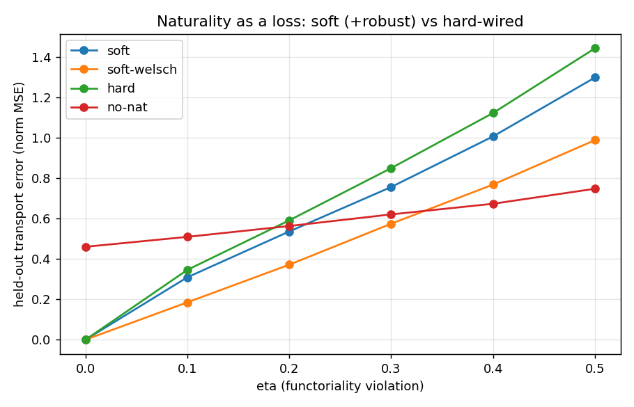

# PreNat: Naturality and Exact Composition as Neural Inductive Biases

*A consolidated technical report. Companion to the running design log in
[Yoneda-NN-Design.md](Yoneda-NN-Design.md); experiments in [experiments/](experiments/).*

---

> ## ⚠️ Status & corrections (v2 — credibility round)
> The sections below (Runs 1–9) are the **historical record**. An independent audit found the science
> reproducible but several **framings overstated**; a rigor round (seeds=10, tie-aware metrics, bootstrap
> CIs, significance tests; see [CHANGELOG.md](CHANGELOG.md), [`rigor.py`](experiments/kg_compose/rigor.py))
> **corrected** them. The current source of truth is **[PAPER.md](PAPER.md) + [CHANGELOG.md](CHANGELOG.md)**.
> Key corrections to read the tables below against:
> - **"Drift-free at any horizon" (Run 9a) is true only for the *exact symbolic* model.** The *learned*
>   PreNat drifts (S4 h=200: **0.14 [0.04,0.33]**, was reported 1.00 at 3 seeds); on small clean worlds a
>   free RESCAL can out-drift it. The guarantee is regime-specific.
> - **"Learning the algebra recovers oracle 0.999" (Run 6b) → 0.967 [0.922,0.999]** (10 seeds), collapsing
>   at 50% data. Indistinguishable from oracle at full data, but not 0.999.
> - **Identifiability "0.17 vs 0.71" (Run 7) was a metric mismatch** (atomic-MRR vs path-Hits@1). Matched
>   MRR: D4 0.13 vs 0.32 (direction holds, smaller); Q8 reverses. Atomic argmax does identify the group.
> - **"Selects the true group 3/3" → Q8 10/10, D4 8/10** (Wilson CIs); discovery now *earns* the exact
>   composition via a discover→identify→commit pipeline ([`discover_compose.py`](experiments/kg_compose/discover_compose.py)).
> - **"Vanilla nets can't compose" (Run 7) cherry-picked atomic vs path**; the MLP composes 2-hops at 0.74.
> - **Naturality-as-a-loss is *not* load-bearing** (rigorously confirmed in the flagship setting,
>   [`nat_kg.py`](experiments/kg_compose/nat_kg.py)); the wins come from the exact/discovered **algebra**.
> The new, *validated* contributions are the **microscope as a predictive instrument** (Spearman 0.95) and
> the **noise-robust uniqueness certificate** (§ Run 10 below).

## Abstract

We set out to turn the Yoneda lemma — *an object is determined by its relationships, naturally* —
from philosophy into a working neural architecture. The result, **PreNat**, makes morphism
**composition exact by construction** (relations live in a fixed associative algebra; multi-hop
composition is the algebra product) and makes **object-indexed naturality** the learned structural
signal. Across six experimental runs we find: (1) *soft, learned* naturality beats *hard-wired*
naturality in the near-functorial regime; (2) on synthetic relational data with genuine algebraic
structure — non-abelian **groups**, non-invertible **monoids**, partial-composition **categories** —
PreNat composes **zero-shot** where abelian KGEs (TransE/RotatE) structurally fail, at a fraction of
the parameters of free-matrix models; (3) the required algebra is **discoverable** from data, by
validation (selecting the true group out of all five of order 8, including the two non-abelian ones)
or by **learning it from scratch** (recovering oracle performance at full data); and (4) on a **real**
KG (UMLS) the learned-algebra model is competitive for atomic link prediction but its exact-
associativity prior does *not* help noisy multi-hop composition. The contribution is thus a prior
whose value is **conditional and mapped**: powerful and data-efficient on algebraically-structured
relations, a mismatch on messy ones. We report the honest negatives as carefully as the wins.

---

## 1. From Yoneda to PreNat

The shallow reading of Yoneda — "represent objects by their relationships" — is already standard
(GNNs, transformers, knowledge-graph embeddings, sheaf nets). The **deep** content is *naturality*:
the relationships must commute with composition. No mainstream architecture trains on "the diagram
must commute." PreNat targets exactly that.

**Formal core.** A small category/algebra with structure constants `T[k,g,h] = 1 iff g∘h = k`. A
morphism is a code `c ∈ ℝ^n`; its representation is `ρ(c) = Σ_k c_k R_k`; composition is the exact
algebra product `μ(a,b) = ` einsum`(T, a, b)`. Because `T` comes from a genuine associative algebra,
**associativity and identity are algebraic identities, never losses** — only the embedding of data
into the algebra is learned. An object `A` is its hom-profile `(h_{b_1→A}, …, h_{b_P→A})`; the
naturality law `μ(h_{b_i→A}, u_{ji}) = h_{b_j→A} ∀A` is the learned constraint.

This generalises in one axis — what algebra `T` encodes:
**group** (invertible) → **monoid** (non-invertible: `is-a`, `causes`) → **category** (typed, partial
composition). The same structure-constant machinery handles all three; only the matrices change.

---

## 2. Experimental program (six runs)

All experiments are small (CPU, seconds–minutes). Two independent adversarial audits (math
correctness + leakage) passed on Run 1 with executed-code evidence.

### Run 1 — Naturality as a loss (synthetic eta-sweep)
*Does soft, learned naturality beat hard-wired naturality?* On near-functorial data with a
functoriality-violation knob `η`:

- **η = 0:** soft = hard = 0.000 (tie predicted — hard-wiring is correctly specified).
- **η > 0:** soft beats hard at every level, gap growing monotonically.
- Naturality is load-bearing: at η=0, soft 0.000 vs no-naturality 0.460 vs abelian 2.16.



### Run 2 — Robust naturality + first learned-ρ
A **redescending (Welsch)** robust naturality loss recovers the high-η regime (soft-welsch beats
plain soft *and* no-naturality through η=0.3). Honest negatives: the `L_comm`/`L_recon` collapse
guards proved **inert** in every tested regime (demoted, not spun); learning ρ from the eta-sweep
regression was hard — which *validated* the "fix the algebra" bet at the time (later cracked, Run 6b).

### Run 3 — External validation (synthetic non-abelian KG, S4)
Standard KG path-query protocol. Train on atomic triples; test held-out **non-abelian** 2-hop
composition (the order-sensitive subset is the discriminator).

| model | path Hits@1 (non-commuting) | rel. params |
|---|---|---|
| RotatE (abelian) | 0.417 | small |
| RESCAL (free matrices) | 0.821 | 6.75× |
| **PreNat** | **1.000** | 1× |

Abelian models cannot tell `r1∘r2` from `r2∘r1`; PreNat composes perfectly; free matrices work but
are data-hungry (at 50% data PreNat 0.530 vs RESCAL 0.210). The win is conditional on the right
algebra — given the *wrong* (abelian) algebra, PreNat fails like RotatE (0.493).

### Run 4 — Discovering the algebra (selection)
Enumerate all five groups of order 8; select by validation. **Selects the true group 3/3 seeds**,
distinguishing even the two *non-abelian* groups (D4 vs Q8) in both directions, and reaching oracle
test performance. Tellingly, *atomic* link prediction does **not** separate the algebras — only the
**compositional** signal does (a Yoneda point: structure is revealed by relationships under
composition, not pointwise behaviour).

### Run 5 — The monoid step (non-invertible composition)
The full transformation monoid T₃ (27 elements, 21 non-invertible). A non-invertible relation maps
distinct heads to one tail — TransE/RotatE act bijectively and **cannot** represent this.

| model | path Hits@1 (non-invertible composites) |
|---|---|
| RotatE | 0.400 |
| RESCAL | 0.820 |
| **PreNat (monoid)** | **0.875** |

Discovery generalises across the group/monoid boundary: given non-invertible data, selection
**discovers it needs a monoid** (picks T₃ over all order-27 groups, 3/3).

### Run 6 — Completing the arc
- **(a) Typed categories / partial composition.** `FiniteCategory` (path category of a DAG; only
  61/576 composites defined). Partial composition is representable and exact (anchored codes →
  incompatible composites collapse to exactly 0). Honest negative: *learned* codes don't auto-lock
  onto the basis on a sparse category (PreNat ≈ RotatE) — the same gauge-looseness as Run 2.
- **(b) Learning the algebra (Run-2 blocker cracked).** Learning the structure constants `γ` from
  **random init** with associativity enforced **recovers oracle (0.999)** on the S4 KG at full data —
  removing the candidate-library requirement when data is sufficient. Caveats: data-hungry (collapses
  at 50%); a *structurally-wrong* warm-start (abelian init on non-abelian data) **hurts** (0.446).
- **(c) Real KG (UMLS).** The learned-algebra PreNat is **competitive — best atomic MRR 0.885**. But
  on noisy 2-hop composition, free-matrix RESCAL wins (0.890 vs 0.549): real relations don't compose
  associatively, so the exact-associativity prior is a mismatch there.

### Run 7 — Broaden, reframe, seed the moonshot
Eight experiments targeting every open direction. Three wins, three honest negatives, one reframe.
- **Soft/approximate associativity (the key fix).** A shared learned algebra **+ a per-relation free
  residual** with one penalty knob interpolating RESCAL↔PreNat. Relaxing it **recovers RESCAL-level
  UMLS composition (0.876 vs the forced-associative 0.549)** while staying best on atomic — and the
  model *self-measures* algebraicity (UMLS ~3%, S4 100%). The double-edged sword becomes a dial.
- **The relational structure microscope (the reframe).** Profiles any dataset's algebraic signature —
  functionality / invertibility / non-abelianness / **algebraicity** — correctly separating group
  (S4: algebraicity 1.05), monoid (T3: 0.94, invertibility 0.12), and messy real (UMLS: 0.60,
  functionality 6.44). A structure-discovery instrument no KGE/GNN provides.
- **LIMN uniqueness-of-mediator certificate (moonshot seed).** Accepts a true product, **rejects a
  too-big apex that factors perfectly but non-uniquely** (the weak-limit test), rejects a too-small
  one. The moonshot's novel atom works.
- **Identifiability (Yoneda, quantified).** A *wrong* algebra fits atomic data as well as the true one
  (atomic spread 0.17) — only composition identifies it (path spread 0.71).
- **"Do transformers have a sense of Yoneda?" — no, not by default.** A vanilla MLP/transformer-lite
  *memorises* group products (held-out 0.218); PreNat with the structure built in *composes* (1.000).
- **Honest negatives.** Naturality self-supervision does **not** rescue scarce data (confirmed in
  fusion, world-model, and learned-algebra-at-50%): under scarcity the bottleneck is entity/state
  under-determination, not composition-consistency. World-model: operator models hold 100% rollout
  vs additive's collapse, but naturality adds nothing when single-step data is complete.

---

## 3. When does PreNat help? (the conditional thesis)

| relational domain | PreNat vs baselines |
|---|---|
| genuinely algebraic (groups, monoids, categories) | **dominant**: zero-shot composition, data-efficient, oracle-perfect, prior is discoverable |
| approximately algebraic / typed real KG | **competitive** for atomic; typed prior plausibly helps (untested on real typed KGs) |
| noisy, non-associative real composition | **a constraint**: free matrices compose better; relax associativity |

The exact-composition + naturality prior is a **double-edged sword**, and we have mapped both edges.

---

## 4. Honest negatives (kept, not buried)

1. `L_comm` / `L_recon` (proposed collapse guards) were **inert** in every tested regime; demoted.
2. Learned codes **do not auto-lock** onto the algebra from loose/sparse data (typed category; Run 2).
3. Learning the algebra is **data-hungry**; fixing/selecting is far more sample-efficient.
4. A **structurally-wrong warm-start hurts** more than random init.
5. On a **real** KG the associativity prior **does not help** multi-hop composition (RESCAL wins) —
   *fixed in Run 7* by soft associativity (a per-relation residual that relaxes the prior).
6. The abelian baseline in early synthetic runs was weak; the trustworthy comparisons are
   soft-vs-hard and PreNat-vs-RESCAL.
7. **Naturality self-supervision does not rescue scarce data** (Run 7, confirmed three ways): under
   scarcity the bottleneck is entity/state under-determination, not composition-consistency. This is
   the one real blocker left, and it gates the LIMN moonshot.
8. **Low-data code-locking resists five attacks** (Run 8): naturality, fix-entity, low-rank γ,
   code-sparsity, *and* amortised transfer all fail to learn the algebra from scarce data (≈0.13 vs
   the fixed oracle's 0.52). The recipe is settled — **fix or select the algebra; don't learn it at
   low data; run LIMN on top of a fixed/selected algebra.** Also: a dataset with *compositional
   semantics* (Kinship) is not necessarily *algebraic as a KG* (it is multi-valued/noisy).

---

## 5. Limitations & future work

- **Scale:** synthetic worlds are tiny (≤120 entities); UMLS is small (135 entities). FB15k-237 /
  WN18RR and a real **ULTRA** comparison remain the credibility step.
- **Bridge to real KGs:** *soft/approximate* associativity (relax `γ`), **per-relation mixtures** of
  small algebras for heterogeneous relations, and applying the typed (§6a) machinery to real KGs
  with domain/range type constraints (FB15k-237) — where it may help as it did not on the sparse
  synthetic DAG.
- **Open piece:** making learned codes lock onto the algebra from loose data without anchoring.
- **Long-horizon:** `LIMN` — universal-property concept minting (discover new latent objects by a
  uniqueness-of-mediator certificate), the one part closest to "discovering new mathematics".

---

## 6. Related work (positioning)

Sheaf NNs / Neural Sheaf Diffusion (learned restriction maps; *local* agreement, no global
naturality); RotatE/TransE/NagE/RESCAL (relation-as-operator; abelian or free, single-object);
hypernetworks / DeepONet (operators from descriptors, no functor laws); ULTRA (object = its
relationships, learned composition only implicitly); Categorical Deep Learning / GAIA (name
Yoneda/Kan as a framework, no gradient-trained naturality-as-loss). PreNat's specific niche:
**object-indexed naturality as the learned constraint over an exact, possibly non-invertible /
partial composition algebra, with that algebra discoverable from data.**

---

## 7. Reproducibility

```bash
# naturality as a loss (Run 1–2)
python experiments/eta_sweep/sweep.py

# non-abelian composition + discovery (Run 3–4)
python experiments/kg_compose/kg_run.py
python experiments/kg_compose/algebra_select.py

# monoid (Run 5), typed categories, learn-the-algebra, real KG (Run 6)
python experiments/kg_compose/kg_monoid.py
python experiments/kg_compose/kg_typed.py
python experiments/kg_compose/kg_learn_algebra.py
python experiments/kg_compose/kg_real.py

# Run 7: reframe + improvements + moonshot seed
python experiments/kg_compose/microscope.py        # the structure microscope (reframe)
python experiments/kg_compose/soft_alg.py          # soft associativity (fixes real-KG loss)
python experiments/kg_compose/identifiability.py   # atomic non-identifiable, composition is
python experiments/kg_compose/grok.py              # 'do transformers have a sense of Yoneda?'
python experiments/kg_compose/worldmodel.py        # actions-as-operators world model
python experiments/kg_compose/limn.py              # uniqueness-of-mediator certificate (LIMN seed)

# Run 8: probe the blocker + more real KGs
python experiments/kg_compose/codelock.py          # code-locking attack (structural fixes - all fail)
python experiments/kg_compose/codelock_transfer.py # amortised transfer attack (also fails)
python experiments/kg_compose/microscope_real.py   # profile UMLS/Kinship/Nations
```

Environment: Python 3.11, PyTorch 2.12 (CPU). Every experiment is self-contained and seeded.

---

## 8. Bottom line

PreNat is a genuine, falsifiable instantiation of the Yoneda intuition: **naturality as a training
signal over an exact composition algebra**. On relational domains with algebraic structure it is a
powerful, data-efficient, *self-discovering* inductive bias that does zero-shot non-abelian and
non-invertible composition no abelian KGE can. On messy real relations the exact-associativity
assumption is a constraint — now *relaxable* by a per-relation residual (soft associativity), which
restores competitiveness and yields a **degree-of-algebraicity** measurement. That measurement is the
project's most broadly useful output: the **relational structure microscope** reframes the work from
"another KGE" into a structure-discovery instrument that reports whether a dataset's relations are
group-like, monoid-like, or messy. The one real blocker left is **learning structure from scarce
data** (naturality does not manufacture signal where there is none) — which also gates the LIMN
moonshot, whose key mechanism (the uniqueness-of-mediator certificate) is nonetheless already
validated. The honest map of where the prior helps — and where it doesn't — is itself the main result.

---

## Run 10 — credibility round (rigor + de-tautologise + earn the framing)

Responding to an independent audit. Every number here is 10 seeds, tie-aware mid-rank metrics,
bootstrap 95% CIs, paired permutation tests; full log in [CHANGELOG.md](CHANGELOG.md).

**10.1 Rigor re-run** ([`rigor.py`](experiments/kg_compose/rigor.py)). Tie-aware ranking does **not**
change the headline (PreNat's 1.000 are genuine strict wins): S4 NONCOMM H@1 PreNat 1.000, RESCAL
0.825 [0.79,0.87], RotatE 0.375 (PreNat−RESCAL p=0.002); T3 path NON-INV PreNat 0.884 [0.84,0.93]. The
50%-data data-efficiency gap is significant (0.69 vs 0.21, p=0.002). Corrections: drift-free is
symbolic-only (learned S4 h=200 → 0.14 [0.04,0.33]); learn-the-algebra is 0.967 [0.922,0.999] not 0.999;
identifiability 0.17-vs-0.71 was a metric mismatch (matched MRR: D4 0.13 vs 0.32, Q8 reverses).

**10.2 Discover → identify → commit** ([`discover_compose.py`](experiments/kg_compose/discover_compose.py)).
The group hidden, the full pipeline selects the true group **7/10 [0.40,0.89]** on clean data and **6/10**
under 30% corruption (the *dedicated* selection experiment over all five order-8 groups, rigor §D, gives
D4 8/10 and Q8 10/10); a discrete step then identifies the relation map and the committed symbolic model
is **exactly drift-free** (h=200: oracle 1.00; discovered 0.78 [0.55,0.93] end-to-end; wrong-C8 0.24;
paired p=0.007). Exact composition is thereby **earned from data**, not handed in.

**10.3 Microscope as a validated instrument**
([`microscope_calibration.py`](experiments/kg_compose/microscope_calibration.py)). Across a controlled
algebraic→messy spectrum, the cheap algebraicity profile predicts the held-out prior-benefit: **Spearman
0.95 [0.85,0.98]** (36 worlds), 97% sign agreement, 97% leave-one-η-out held-out sign prediction.

**10.4 Naturality-as-a-loss, finally tested in the flagship setting**
([`nat_kg.py`](experiments/kg_compose/nat_kg.py)). **Honest negative:** no significant gain at any data
fraction; the robust variant hurts at low data. The project's original headline mechanism is **not**
load-bearing; the wins come from the exact/discovered composition algebra. The framing is updated
accordingly (PAPER.md).

**10.5 Uniqueness certificate, made non-tautological**
([`limn_hard.py`](experiments/kg_compose/limn_hard.py)). Unknown, varying latent dimension + noisy cones:
existence is ambiguous (≈4 over-complete apexes fit; naive "biggest that fits" → 0.00 accuracy), while
the uniqueness certificate recovers the true dimension at **1.00 [0.98,1.00]** across noise levels
(beating Occam-smallest under noise), minted subspace factors held-out cones 100%.

**Run 10 net.** The reproducible science survives with rigor and significance; the overstatements are
corrected; the headline is de-tautologised (discovery earns it); and two contributions are now
genuinely *validated* (the predictive microscope, the noise-robust certificate) while the original
naturality mechanism is honestly retired as non-load-bearing.
